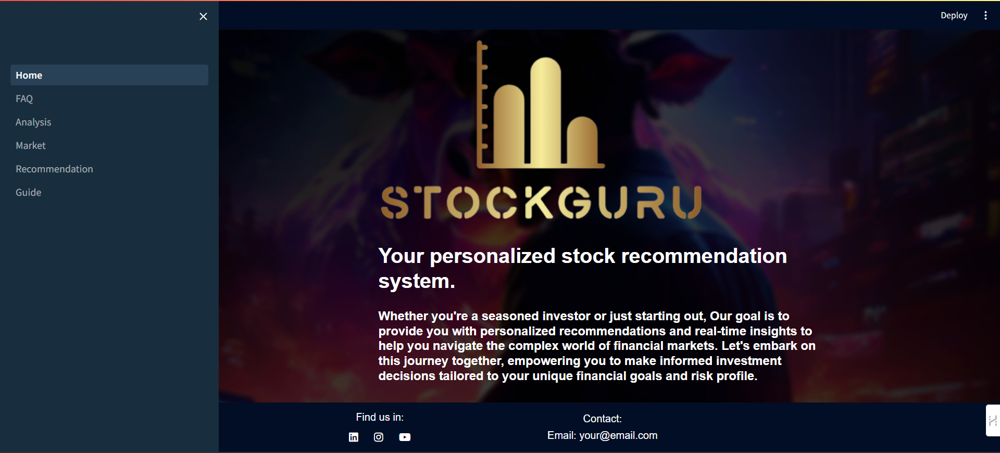
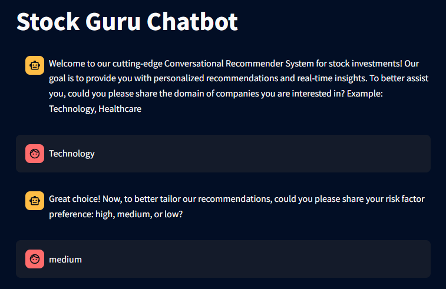
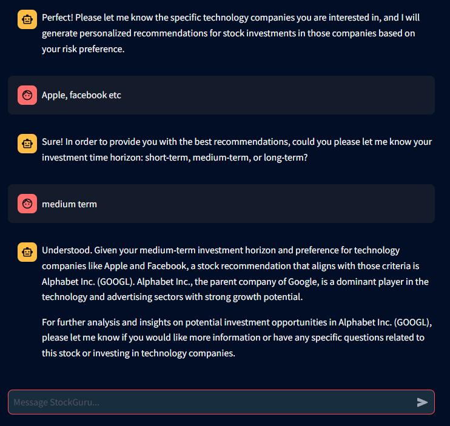
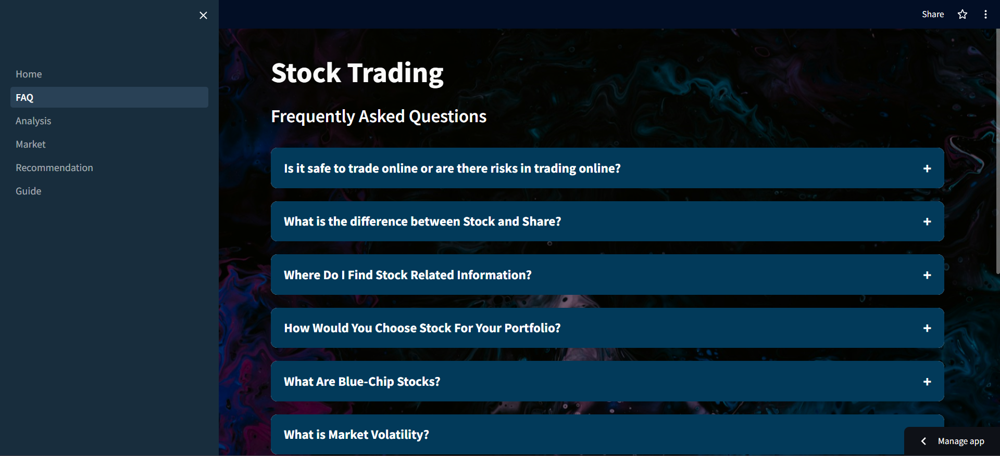
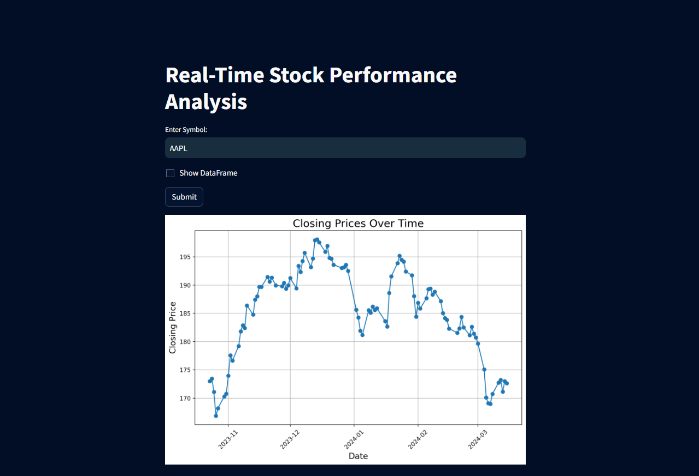
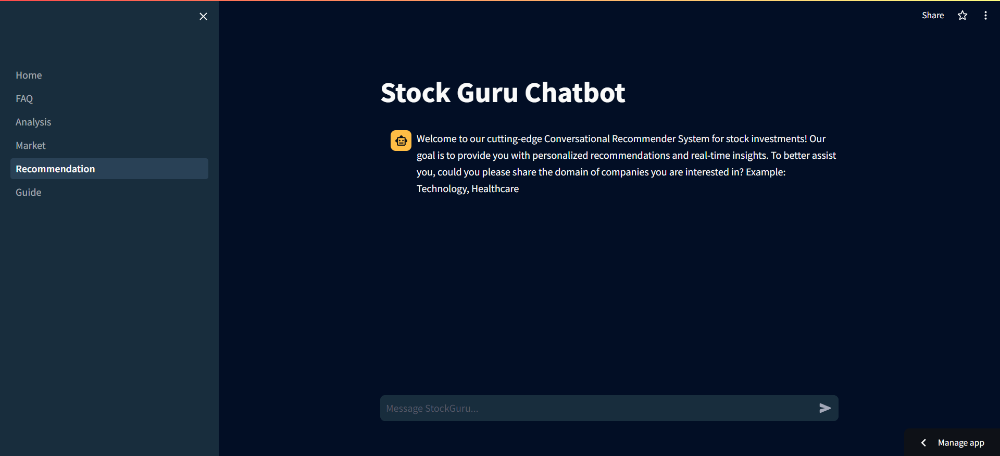
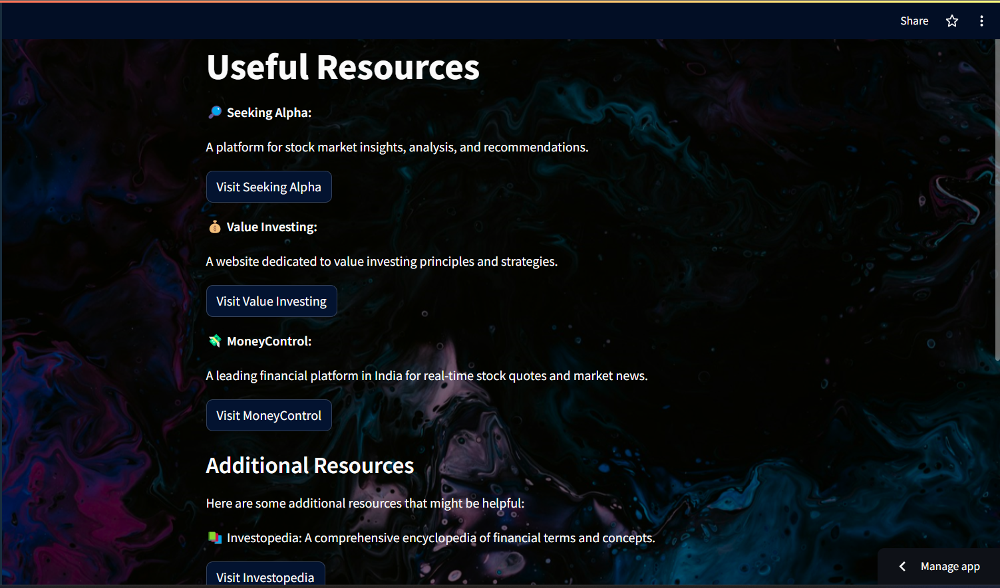

# Stock-Guru

### A Personalized stock recommendation system.

  

Our primary goal with the Stock-Guru project, powered by Streamlit, is to provide personalized stock recommendations and real-time insights, guiding users through the complexities of financial markets. 

By leveraging technologies such as Matplotlib, SciPy, Scikit-learn, Pandas, and NumPy, we aim to equip you with tailored suggestions and timely updates, empowering you to navigate the dynamic world of investments with confidence. 

Join us on this collaborative journey where we strive to arm you with the necessary knowledge and tools to make informed decisions that align perfectly with your financial goals and risk profile.

## Getting Started

  

1. Welcome to Stock-Guru's home page, your gateway to personalized stock recommendations. Here, we introduce you to our mission, which is to provide tailored suggestions and real-time updates to help you make informed investment decisions aligned with your financial goals and risk tolerance.
2. Let our chatbot assist you in finding the perfect stock recommendations tailored to your preferences.
   - Let us know the domain you're interested in.
   - What is your risk factor?
   - Tell if you have specific set of companies that you have in mind.
   - Let us know about your preference regarding term of the investment.
   - Now the model will suggest you some stocks based on your preferences.

  
  

4. Got questions about stocks or the market? Find answers to frequently asked questions here to deepen your understanding.
5. Ready to dive into the numbers? Let us provide you with recent statistics and visualizations.
   - Enter a stock symbol to retrieve recent statistics and insights.
   - Visualize recent data trends through plotted graphs for better understanding.
6. Stay updated with current trends and news about the stock market to make timely decisions.

## The Solution

### 🤔 Frequently Asked Questions

- Got questions about stocks or the market? Find answers to frequently asked questions here to deepen your understanding.

  

### 📊 Analysis

- Visualize recent data trends based on stock symbols through plotted graphs for better understanding.

  

#### Example

**Company**: Apple

**Symbol**: AAPL

|   Date   |   Open   |   High   |    Low    |  Close  |
|:---------:|:--------:|:--------:|:---------:|:-------:|
| 2024-03-15 | 171.1700 | 172.6200 | 170.2850 | 172.62 |
| 2024-03-14 | 172.9100 | 174.3078 | 172.0500 |   173   |
| 2024-03-13 | 172.7700 | 173.1850 | 170.7600 | 171.13 |
| 2024-03-12 | 173.1500 | 174.0300 | 171.0100 | 173.23 |
| 2024-03-11 | 172.9400 | 174.3800 | 172.0500 | 172.75 |
| 2024-03-08 | 169.0000 | 173.7000 | 168.9400 | 170.73 |
| 2024-03-07 | 169.1500 | 170.7300 | 168.4900 |   169   |
| 2024-03-06 | 171.0600 | 171.2400 | 168.6800 | 169.12 |
| 2024-03-05 | 170.7600 | 172.0400 | 169.6200 | 170.12 |
| 2024-03-04 | 176.1500 | 176.9000 | 173.7900 | 175.1  |

### 📈 Market

- Display current trends and news about stocks to keep you informed and ahead of the curve.

  

### 💡 Recommendation

- Utilize our chatbot to receive stock recommendations based on your preferences.
- Provide preferences such as domain, risk factor, specific company interest, and term of investment to receive tailored recommendations.

  

### 📚 Know more

- Access a curated collection of resources and articles for further information and insights.

  

## Resources

- 🔎 [Seeking Alpha](https://seekingalpha.com/)
- 💰 [Value Investing](https://valueinvesting.io/)
- 💸 [MoneyControl](https://www.moneycontrol.com/)
- 💼 [Investopedia](https://www.investopedia.com/)
- 🃏 [The Motley Fool](https://www.fool.com/)
- 💹 [Yahoo! Finance](https://finance.yahoo.com/)
- 📰 [MarketWatch](https://www.marketwatch.com/)

## Technologies

#### 🔗 APIs

**Alpha Vantage**: Comprehensive financial data APIs that have been instrumental in powering our stock analysis and recommendation features.

**OpenAI API**: For their cutting-edge language processing capabilities, which has empowered us to develop an intelligent chatbot for personalized stock recommendations.

#### 🔧 Tech Stack and Libraries

**Streamlit**: Offers an intuitive platform for building and deploying data-driven web applications, making it possible for us to create an interactive user interface for Stock-Guru.

**Matplotlib**: To create insightful graphs and plots for data analysis.

**NumPy**: To do numerical computing in Python, which is crucial for data manipulation and analysis.

**Pandas**: For versatile data manipulation and analysis and to facilitate our data handling tasks.

**SciPy**: To leverage essential tools and functions for scientific computing, enhancing the capabilities of our statistical analysis components.

**Feedparser**: For RSS feed parsing, to aggregate and display current trends and news about the stock market.

## License
GPL-3.0 license
